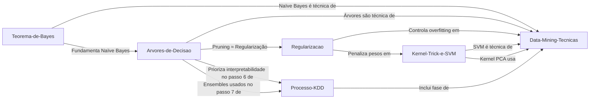

# Gemini Knowledge Engine (GKE) — Documentação da Arquitetura

> Sistema de base de conhecimento pessoal gerenciado por IA, inspirado no padrão "LLM Wiki" de Andrej Karpathy. Escrito e mantido integralmente em Português do Brasil (pt-BR).

---

## 1. Objetivo do Sistema

O **Gemini Knowledge Engine (GKE)** é uma base de conhecimento persistente e acumulativa que conecta conhecimento abstrato (teorias, métodos, padrões) à prática empírica (projetos reais, análises, decisões). Ele opera dentro do ecossistema **Obsidian**, utilizando Markdown como formato nativo e uma CLI Python para indexação e busca híbrida.

O sistema é mantido por um agente de IA (Gemini/GPT) que atua como Knowledge Engineer, seguindo regras estritas documentadas em `GKE_RULES.md`.

---

## 2. Estrutura de Arquivos

```
Obsidian/
├── .git/                          # Controle de versão Git
├── .gitignore                     # Exclui .venv do versionamento
├── prompt.md                      # System prompt de inicialização do GKE
├── Pesquisa Lexica.txt            # Notas auxiliares de pesquisa
└── base_conhecimento/             # Raiz da base de conhecimento (vault Obsidian)
    ├── .obsidian/                 # Configuração nativa do Obsidian
    │   ├── app.json
    │   ├── appearance.json
    │   ├── core-plugins.json
    │   ├── graph.json
    │   └── workspace.json
    ├── .venv/                     # Ambiente virtual Python (ignorado pelo Git)
    ├── GKE_RULES.md               # Contrato de arquitetura e regras operacionais
    ├── search.py                  # CLI de busca híbrida (BM25 + semântica)
    ├── requirements.txt           # Dependências Python
    ├── wiki_search_index.db       # Banco SQLite de indexação vetorial
    ├── Clippings/                 # Backlog pendente de processamento
    ├── raw/                       # Fontes imutáveis de entrada
    │   ├── core-knowledge/        # Artigos, teorias, conceitos
    │   └── logbook/               # Projetos e dados empíricos
    └── wiki/                      # Base de conhecimento compilada
        ├── index.md               # Catálogo mestre (grafo de conexões)
        ├── log.md                 # Log cronológico de operações (append-only)
        ├── core-knowledge/        # Artigos sintetizados de teoria
        └── logbook/               # Ciclos de vida de projetos reais
```

### 2.1 Função de cada diretório

| Diretório | Mutabilidade | Função |
|---|---|---|
| `Clippings/` | Temporário | Backlog de arquivos capturados via extensão Web Clipper do Obsidian. Prioridade alta no processamento. Sempre vazio após ingestão. |
| `raw/core-knowledge/` | Imutável | Fontes originais preservadas como "verdade fundamental". Nunca são editados pelo GKE. |
| `raw/logbook/` | Imutável | Dados brutos de projetos e análises empíricas. |
| `wiki/core-knowledge/` | Editável pelo GKE | Artigos sintetizados e estruturados em pt-BR. O "Cofre Conceitual". |
| `wiki/logbook/` | Editável pelo GKE | Ciclos de vida de projetos. O "Diário Empírico". |
| `wiki/index.md` | Editável pelo GKE | Catálogo mestre com grafo de conexões Mermaid.js. |
| `wiki/log.md` | Append-only | Registro cronológico de todas as operações do GKE com hashes SHA-256. |

---

## 3. O Fluxo de Vida do Conhecimento

O GKE segue um ciclo de 4 fases documentado em `GKE_RULES.md` (§ 3.0):

```
┌─────────────────────────────────────────────────────────────────┐
│                    CICLO DE VIDA DO CONHECIMENTO                │
├─────────────────────────────────────────────────────────────────┤
│                                                                 │
│  FASE 1: INGESTÃO & TRIAGEM                                     │
│  ┌─────────────────────┐    ┌──────────────────────┐           │
│  │  Clippings/ (1ª)    │───▶│  raw/ (2ª)           │           │
│  └─────────┬───────────┘    └──────────┬───────────┘           │
│            └──────────┬────────────────┘                        │
│                       ▼                                         │
│            ┌──────────────────────┐                             │
│            │  Checksum Protocol   │  ← SHA-256 vs log.md        │
│            │  (Detecta mudanças)  │                             │
│            └──────────┬───────────┘                             │
│                       ▼                                         │
│            ┌──────────────────────┐                             │
│            │  Mudança detectada?  │──Não──▶ Ignorar             │
│            └──────────┬───────────┘                             │
│                       │Sim                                      │
│                       ▼                                         │
│  FASE 2: PROCESSAMENTO COGNITIVO                                │
│  ┌──────────────────────────────────────┐                       │
│  │  • Tradução/síntese para pt-BR       │                       │
│  │  • Extração de entidades/metadados   │                       │
│  │  • Normalização (sinônimos → nó mestre)│                      │
│  │  • YAML Frontmatter padronizado      │                       │
│  └──────────────────┬───────────────────┘                       │
│                     ▼                                           │
│  FASE 3: INTEGRAÇÃO DE REDE                                     │
│  ┌──────────────────────────────────────┐                       │
│  │  • Law of Associative Linking        │                       │
│  │  • Promoção de conceitos (3ª aparição)│                      │
│  │  • Atualização do index.md e log.md  │                       │
│  └──────────────────┬───────────────────┘                       │
│                     ▼                                           │
│  FASE 4: AUDITORIA DE INTEGRIDADE                               │
│  ┌──────────────────────────────────────┐                       │
│  │  • Notas órfãs / Links quebrados     │                       │
│  │  • Refatoração e re-conexão          │                       │
│  └──────────────────────────────────────┘                       │
│                                                                 │
└─────────────────────────────────────────────────────────────────┘
```

---

## 4. Checksum Protocol — Detecção de Mudanças

Para evitar reprocessamento desnecessário, o GKE **não confia em timestamps** do sistema de arquivos. Em vez disso, utiliza hashing criptográfico.

### 4.1 Mecanismo

```
Arquivo bruto → SHA-256(hash) → Comparar com registro em log.md
                                         │
                          ┌────────────────┼────────────────┐
                          │                │                │
                     Hash inédito     Hash idêntico    Hash diferente
                          │                │                │
                     PROCESSAR         IGNORAR         REPROCESSAR
```

### 4.2 Registro

Cada hash é registrado no `wiki/log.md` associado ao caminho do arquivo:

```markdown
| Decision Trees.md | 13061C65...DBF0F | ❌ Novo |
```

### 4.3 Critérios de Gatilho

Um arquivo será processado se:
1. **Não constar** no registro de hashes (arquivo novo).
2. **O hash atual for diferente** do hash registrado (conteúdo alterado).

---

## 5. Técnica de Indexação — Busca Híbrida

O sistema de busca (`search.py`) implementa uma arquitetura **híbrida** combinando busca lexical e semântica.

### 5.1 Arquitetura

```
┌─────────────────────────────────────────────────────────┐
│                    PIPELINE DE BUSCA                      │
├─────────────────────────────────────────────────────────┤
│                                                           │
│  QUERY DO USUÁRIO                                        │
│       │                                                   │
│       ├──────────────────────┬───────────────────────┐   │
│       ▼                      ▼                       │   │
│  ┌─────────────┐    ┌────────────────┐               │   │
│  │  Tokenizer  │    │   Embedding    │               │   │
│  │  (pt-BR/EN) │    │  (Ollama ou    │               │   │
│  │  Stopwords  │    │   TF-IDF)      │               │   │
│  └──────┬──────┘    └───────┬────────┘               │   │
│         ▼                   ▼                         │   │
│  ┌─────────────┐    ┌────────────────┐               │   │
│  │  BM25Okapi  │    │  Cosine Sim    │               │   │
│  │  (Lexical)  │    │  (Semantic)    │               │   │
│  └──────┬──────┘    └───────┬────────┘               │   │
│         │                   │                         │   │
│         └─────────┬─────────┘                         │   │
│                   ▼                                   │   │
│         ┌──────────────────┐                          │   │
│         │  Reciprocal Rank │                          │   │
│         │  Fusion (RRF)    │  k=60                    │   │
│         └────────┬─────────┘                          │   │
│                  ▼                                    │   │
│         ┌──────────────────┐                          │   │
│         │  Top-N Resultados│                          │   │
│         └────────┬─────────┘                          │   │
│                  ▼                                    │   │
│         ┌──────────────────┐                          │   │
│         │  Síntese (Opc.) │  ← llama3 via Ollama     │   │
│         └──────────────────┘                          │   │
│                                                       │   │
└───────────────────────────────────────────────────────┘   │
```

### 5.2 Componentes

| Componente | Tecnologia | Função |
|---|---|---|
| **Tokenização** | Regex + stopwords pt-BR/EN | Normalização de texto, remoção de acentos, stemming simplificado |
| **Índice Lexical** | `rank-bm25` (BM25Okapi) | Busca por termos exatos — IDs técnicos, nomes de algoritmos, APIs |
| **Índice Semântico ( primário)** | Ollama + `nomic-embed-text` | Embeddings densos para busca conceitual abstrata |
| **Índice Semântico (fallback)** | TF-IDF local (cosine similarity) | Quando Ollama está offline — busca por relevância estatística |
| **Fusão de Rankings** | Reciprocal Rank Fusion (RRF) | Combina postos das duas buscas: `RRF(d) = Σ 1/(k + rank_i(d))` |
| **Síntese Generativa** | Ollama + llama3 (opcional) | Gera resposta em linguagem natural a partir dos trechos recuperados |

### 5.3 Banco de Dados SQLite (`wiki_search_index.db`)

```sql
-- Tabela de arquivos indexados
CREATE TABLE files (
    id            INTEGER PRIMARY KEY,
    relative_path TEXT UNIQUE,
    tags          TEXT,        -- JSON array
    frontmatter   TEXT         -- JSON object
);

-- Tabela de chunks (seções dos arquivos Markdown)
CREATE TABLE chunks (
    id            INTEGER PRIMARY KEY,
    file_id       INTEGER,    -- FK → files.id
    header        TEXT,       -- Caminho do cabeçalho (ex: "## X > ### Y")
    content       TEXT,       -- Conteúdo textual do chunk
    dense_vector  TEXT,       -- JSON array de floats (embedding Ollama)
    tfidf_vector  TEXT,       -- JSON dict {token: peso_tf_idf}
    tokens        TEXT,       -- Tokens separados por espaço
    FOREIGN KEY(file_id) REFERENCES files(id) ON DELETE CASCADE
);

-- Metadados gerais (modo de indexação, modelo utilizado)
CREATE TABLE metadata (
    key   TEXT PRIMARY KEY,
    value TEXT
);
```

### 5.4 Chunking

Os arquivos Markdown são divididos em **chunks por cabeçalho** (`#` a `####`). Cada chunk herda o caminho completo de cabeçalhos (ex: `"Árvores de Decisão > Divisão (Splitting)"`), preservando contexto hierárquico para a busca.

### 5.5 Comandos da CLI

```bash
# Reconstruir o índice completo
python search.py --index

# Buscar por texto
python search.py --query "o que é regularização"

# Busca verbosa com scores detalhados
python search.py --query "ensemble methods" --verbose --top 10

# Busca com síntese generativa
python search.py --query "explique KNN" --synthesize --gen-model llama3

# Usar modelo de embedding específico
python search.py --index --model mxbai-embed-large
```

---

## 6. Schema de Metadados (YAML Frontmatter)

Todo arquivo `.md` na `wiki/` obrigatoriamente possui:

```yaml
---
tags: [core/machine-learning, core/classificacao]
created: 2026-05-27
updated: 2026-06-06           # Opcional — data da última atualização
original_source:
  - "raw/core-knowledge/arquivo.md"
author: Gemini Synthesis
keywords: [keyword1, keyword2]
aliases: [nome alternativo]    # Opcional — sinônimos do conceito
---
```

### Campos obrigatórios

| Campo | Tipo | Descrição |
|---|---|---|
| `tags` | array | Taxonomia no formato `core/tema` ou `logbook/subtema` |
| `created` | data | Data de criação original (YYYY-MM-DD) |
| `original_source` | array | Caminhos para as fontes em `raw/` ou `Clippings/` |
| `author` | string | Autor original ou "Gemini Synthesis" |
| `keywords` | array | Palavras-chave técnicas para indexação |

---

## 7. Law of Associative Linking

Regra fundamental que impede a fragmentação do conhecimento:

```
┌──────────────────────┐          ┌──────────────────────┐
│  wiki/core-knowledge │◄────────▶│  wiki/core-knowledge │
│  (Conceito A)        │  links   │  (Conceito B)        │
└──────────┬───────────┘  cruzados└──────────┬───────────┘
           │                                 │
           │ usou                             │ fundamenta
           │                                 │
           ▼                                 ▼
    ┌──────────────────────┐          ┌──────────────────────┐
    │  wiki/logbook/       │          │  raw/core-knowledge/ │
    │  (Projeto Empírico)  │          │  (Fonte Original)    │
    └──────────────────────┘          └──────────────────────┘
```

- Um `logbook` que usa uma técnica deve linkar para `[[Conceito]]` no `core-knowledge`.
- Um `core-knowledge` deve mencionar projetos no `logbook` que aplicam aquele conceito.
- Fontes em `raw/` são linkadas via `[[raw/core-knowledge/arquivo.md]]` na seção "Fonte Original".

---

## 8. Protocolo de Promoção de Conceitos

Um termo (tag) é promovido a página de `core-knowledge` quando:

1. Atinge a **3ª aparição** em arquivos distintos, OU
2. É identificado como conceito central em um novo processamento.

A promoção **não cria páginas vazias** — o GKE deve:
- Consolidar definições de todas as fontes originais.
- Expandir com explicação técnica completa.
- Incluir obrigatoriamente um diagrama **Mermaid.js**.
- Linkar para todas as fontes e aplicações empíricas.

---

## 9. Dependências Python

```
pymupdf4llm>=0.0.17    # Extração de PDFs para Markdown
python-docx>=1.1.2     # Leitura de documentos Word
markdownify>=0.13.1    # Conversão HTML → Markdown
beautifulsoup4>=4.12.3  # Parsing de HTML
sqlalchemy>=2.0.0       # ORM (disponível, não utilizado diretamente)
rank-bm25>=0.2.2       # Implementação BM25 para busca lexical
requests>=2.31.0       # Cliente HTTP para API do Ollama
```

**Dependências externas (não Python):**
- [Ollama](https://ollama.com/) — Runtime local para modelos de embedding/geração
- Modelo `nomic-embed-text` — Geração de embeddings densos
- Modelo `llama3` — Síntese generativa de respostas (opcional)

---

## 10. Formato dos Diagramas Mermaid.js

O GKE utiliza Mermaid.js para representar visualmente:
- **Grafo de conexões** entre conceitos (`index.md`)
- **Fluxos de processos** (KDD, CRISP-DM, ciclo de vida)
- **Mapas mentais** de técnicas (Data Mining)
- **Topologias** de estruturas (árvores de decisão)

```markdown
```mermaid
graph LR
    A["[[Conceito A]]"] -->|"relação"| B["[[Conceito B]]"]
`` ``
```

---

## 11. Regras de Nomenclatura

| Elemento | Formato | Exemplo |
|---|---|---|
| Arquivo de conceito | `Nome-Do-Conceito.md` (PascalCase com hífens) | `Teorema-de-Bayes.md` |
| Arquivo de logbook | `nome-do-projeto.md` (lowercase com hífens) | `analise-churn.md` |
| Tags core | `core/subtema` | `core/machine-learning` |
| Tags logbook | `logbook/subtema` | `logbook/analysis-in-progress` |
| Links wiki | `[[Nome-Do-Arquivo]]` | `[[Arvores-de-Decisao]]` |
| Links com alias | `[[Nome-Do-Arquivo\|Texto Visível]]` | `[[Arvores-de-Decisao\|Árvores de Decisão]]` |

---

## 12. Comandos Úteis

```bash
# Navegar até a base
cd base_conhecimento/

# Ativar ambiente virtual
.venv\Scripts\activate        # Windows
source .venv/bin/activate     # Linux/Mac

# Instalar dependências
pip install -r requirements.txt

# Indexar a wiki
python search.py --index

# Buscar
python search.py --query "sua busca aqui"

# Verificar integridade do Git
git status
git log --oneline -5
```

---

## 13. Estado Atual da Base (Junho 2026)

### Artigos no Core-Knowledge

| Arquivo | Tema | Fontes |
|---|---|---|
| `Teorema-de-Bayes.md` | Probabilidade, Naïve Bayes, MAP, Otimização Bayesiana | 3 |
| `Arvores-de-Decisao.md` | CART, C4.5, CHAID, QUEST, ensembles, scikit-learn | 4 |
| `Regularizacao.md` | L1/L2/Dropout, Bias-Variance, generalização | 2 |
| `Kernel-Trick-e-SVM.md` | Kernels, SVM, extensões | 2 |
| `Data-Mining-Tecnicas.md` | Técnicas completas + CRISP-DM | 1 |
| `Processo-KDD.md` | KDD de 9 etapas | 1 |

### Grafo de Conexões



---

*Documento gerado pelo Gemini Knowledge Engine em 2026-06-06.*
*Fonte: `GKE_RULES.md`, `search.py`, `wiki/log.md`.*
