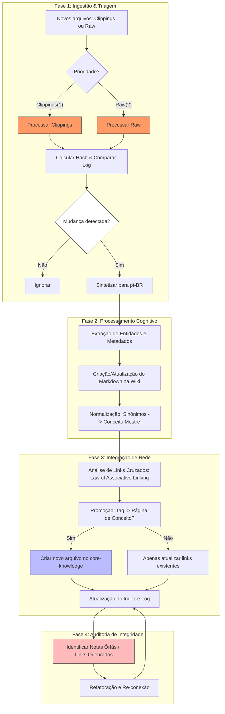

# Gemini Knowledge Engine (GKE) - Regras e Operação

## 1. System Objective & Scope
Este documento atua como a arquitetura e contrato de memória para o ambiente **Gemini Knowledge Engine (GKE)** da pasta `base_conhecimento`. 
O objetivo deste sistema é unir conhecimentos abstratos à prática empírica, mantendo a documentação estritamente em **Português do Brasil (pt-BR)**. O fluxo foca na ingestão de arquivos na subpasta `raw/` e a consolidação de informações interligadas na subpasta `wiki/`.

## 2. Directory Structure
A estrutura de diretórios foi desenhada para separar dados brutos de conhecimento consolidado:

*   **`Clippings/`**: Arquivos capturados via extensão "Web clipping" do Obsidian. Deve ser processada com **prioridade** sobre a pasta `raw/`. Após o processamento, os arquivos **devem ser movidos** para `raw/core-knowledge/` (ver SOP § 3.1).
*   **`raw/`**: Arquivos imutáveis de entrada (artigos originais, PDFs, clippings manuais).
    *   `raw/core-knowledge/`: Para conceitos e teorias (ex: padrões de arquitetura, métodos estatísticos).
    *   `raw/logbook/`: Para projetos e dados empíricos de análises (ex: anotações de um pipeline de dados real).
*   **`wiki/`**: Base de conhecimento estruturada e compilada (editada ativamente pelo GKE).
    *   `wiki/core-knowledge/`: Arquivos Markdown de teorias (O Cofre Conceitual).
    *   `wiki/logbook/`: Arquivos Markdown do ciclo de vida de projetos reais (O Diário Empírico).

### 2.1 The Law of Associative Linking
Sempre que o GKE processar ou atualizar um arquivo na `wiki/`, **deve cruzar referências**. 
* Um `logbook` que usa um padrão (ex: EDA) deve ter um link interno para `[[EDA]]` (ou nome equivalente) do `core-knowledge`.
* Um conceito no `core-knowledge` deve mencionar ou linkar para as análises e projetos no `logbook` que aplicaram aquele padrão.

## 3. Standard Operating Procedures (SOPs)

### 3.0 Ciclo de Vida do Conhecimento (Workflow Global)



**Etapas do Fluxo:**
1. **Ingestão:** Triagem de arquivos com prioridade para `Clippings/`.
2. **Processamento:** Transformação em pt-BR, extração de metadados e normalização de termos (resolução de sinônimos).
3. **Integração:** Aplicação da *Law of Associative Linking* e **Promoção** de tags frequentes para novos arquivos de conceito no `core-knowledge`.
4. **Manutenção:** Auditoria para identificar notas órfãs ou links quebrados, garantindo a integridade do grafo.

### Ingestão (Ingest Protocol)

#### 3.1 Critério de Detecção de Mudanças (Checksum Protocol)
Para garantir a integridade e evitar reprocessamento desnecessário, o GKE não deve confiar em timestamps do sistema de arquivos. 
*   **Mecanismo:** O GKE deve gerar um hash (ex: SHA-256) do conteúdo de cada arquivo em `Clippings/` e `raw/`.
*   **Rastreamento:** Este hash deve ser registrado no `wiki/log.md` associado ao caminho do arquivo.
*   **Gatilho de Re-processamento:** Um arquivo será processado se:
    1.  O arquivo não constar no registro de hashes.
    2.  O hash atual for diferente do hash registrado (indicando alteração no conteúdo).

1. O Usuário salva marcações na pasta `Clippings/` (gerada pela extensão) ou deposita arquivos manualmente na pasta respectiva dentro de `raw/`.
2. O Usuário solicita que o GKE processe as novidades.
3. O GKE processa **primeiro a pasta `Clippings/`** (maior prioridade) e, em seguida, a pasta `raw/`.
4. O GKE lê os arquivos, traduz/sintetiza para pt-BR e cria/atualiza os arquivos Markdown correspondentes em `wiki/`.
5. **Análise de Referências**: Ao finalizar a criação dos Markdowns, o GKE **obrigatoriamente** inicia uma ferramenta/análise lógica varrendo a base para criar e atualizar os links cruzados entre os temas recém-processados e o restante da wiki.
6. O GKE atualiza o `wiki/index.md` e registra a ação no `wiki/log.md`.
7. **Arquivamento pós-processamento**: Após o processamento bem-sucedido de cada arquivo da pasta `Clippings/`, o GKE **move o arquivo** para `raw/core-knowledge/`. Isso garante que a fonte original seja preservada como registro imutável e que a pasta `Clippings/` contenha apenas itens pendentes de ingestão.


### 3.1 Regra de Arquivamento de Clippings

> 🔴 **OBRIGATÓRIO:** Todo arquivo processado da pasta `Clippings/` **deve ser movido** para `raw/core-knowledge/` ao final do ciclo de ingestão. A pasta `Clippings/` deve sempre refletir apenas o **backlog pendente** de processamento — nunca arquivos já sintetizados na `wiki/`.

## 4. Markdown & Formatting Standards

### 4.1 Metadata Schema (YAML Frontmatter)
Todo arquivo `.md` na `wiki/` deve obrigatoriamente possuir o seguinte bloco no início:
```yaml
---
tags: [core/architecture, core/data-science, logbook/analysis-in-progress, logbook/decision]
created: YYYY-MM-DD
sources: [links ou caminhos para arquivos em /raw]
author: Gemini Synthesis
keywords: [palavra-chave 1, palavra-chave 2]
---
```

### 4.2 Representação Visual (Mermaid.js)
Ao explicar fluxos complexos, topologias de integração, modelos de dados ou relacionamentos entre tabelas, o GKE deve criar de forma proativa diagramas **Mermaid.js** no corpo do Markdown.

## 5. Iterative Analysis Update Protocol (Data Analysis Lifecycle)
Quando for criar um logbook na `wiki/logbook/`, siga este framework modular e iterativo:
1. **Problem Context & Learning Agenda**: Definição, metas e glossário (com links para o `core-knowledge`).
2. **Scope & Objectives**: Escopo da análise, filtros, metas, métricas alvo/proxy e KPIs.
3. **Data Strategy & Modeling**: Fontes de dados evolutivas e diagramas do modelo (via Mermaid.js).
4. **Exploratory Data Analysis (EDA) & Engineering**: Achados preliminares e requisitos de limpeza/engenharia.
5. **Execution & Provenance**: Ferramenta utilizada e source script (Python, PBI, etc), algoritmos selecionados.
6. **Insights, Hypotheses & Iterations**: Validações de hipóteses, lacunas encontradas, resultados de drivers e técnicas iteradas.
7. **Recommendations & Conclusion**: Drivers técnicos e de negócio para conclusão final.
*Estes módulos podem ser omitidos se não fizerem sentido para a análise em questão.*

## 6. Hybrid Search Specification (Blueprint)
*Este é o projeto conceitual de um motor de busca a ser implementado por um script Python futuramente.*
A base utilizará:
*   **BM25 (Lexical Matching)**: Perfeito para IDs técnicos e buscas exatas de código.
*   **Dense Vector Embeddings (Semantic Matching)**: Busca conceitual abstrata (ex: dúvidas de negócio).
*   **Pipeline Estruturado**: CLI lê diretórios, fragmenta, usa `rank-bm25` + um modelo local de sentenças (via HuggingFace ou Ollama) armazenado em banco de dados vetorizado em disco.
