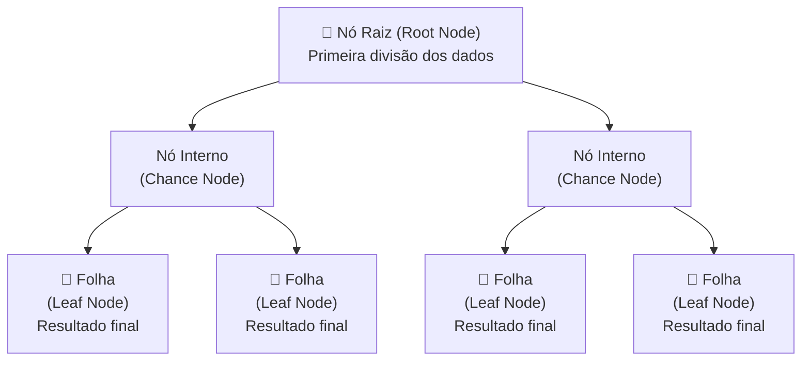
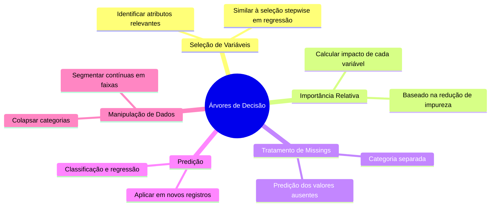

# Árvores de Decisão

## O Que São

**Árvores de Decisão** são modelos de mineração de dados que classificam populações em subgrupos de forma hierárquica e visual, construindo uma estrutura semelhante a uma árvore invertida. São um dos métodos mais utilizados em pesquisa médica e científica por serem intuitivos e **não paramétricos**.

> *Fonte: Song & Lu, Shanghai Jiao Tong University — "Decision tree methods: applications for classification and prediction" (PMC4466856)*

---

## Estrutura de uma Árvore de Decisão

### Tipos de Nós

| Nó | Também chamado | Função |
|---|---|---|
| **Nó Raiz** | Decision Node | Divisão inicial — todos os registros partem daqui |
| **Nó Interno** | Chance Node | Representa uma possibilidade a partir do nó pai |
| **Nó Folha** | End Node / Leaf | Resultado final de uma sequência de decisões |

---

## Conceitos Fundamentais

### Divisão (Splitting)

O algoritmo seleciona as variáveis de entrada **mais relevantes** para dividir os nós pai em nós filhos mais "puros" em relação à variável alvo. Os critérios de pureza mais comuns são:

- **Índice Gini** — mede a impureza de uma divisão
- **Entropia / Ganho de Informação** — baseado em teoria da informação
- **Qui-Quadrado (Chi-Square)** — testa independência estatística
- **Critério Twoing** — combinação de ganhos

### Parada (Stopping)

Regras de parada evitam que a árvore cresça excessivamente e sofra **overfitting**:

- Número mínimo de registros em um nó folha
- Número mínimo de registros antes de dividir
- Profundidade máxima da árvore

> 🔖 **Regra prática (Berry & Linoff):** A proporção de registros em cada folha deve estar entre **0,25% e 1%** do dataset de treinamento.

### Poda (Pruning)

Quando as regras de parada não são suficientes, a árvore é **podada** após crescer:

| Tipo de Poda | Descrição |
|---|---|
| **Pré-poda** (forward) | Usa testes estatísticos (Chi-square) para evitar divisões não significativas durante o crescimento |
| **Pós-poda** (backward) | Cresce a árvore completa e remove ramos que não melhoram a acurácia em dados de validação |

---

## Algoritmos Disponíveis

| Método | Critério de Seleção | Poda | Variável Alvo | Split |
|---|---|---|---|---|
| **CART** | Gini Index, Twoing | Pré-poda (single-pass) | Categórica / Contínua | Binário |
| **C4.5** | Entropia / Ganho de Informação | Pré-poda (single-pass) | Categórica / Contínua | Múltiplo |
| **CHAID** | Qui-Quadrado | Pré-poda (independência) | Categórica | Múltiplo |
| **QUEST** | Chi-square (categ.) / ANOVA (cont.) | Pós-poda | Categórica | Binário |

> **C5.0** é a versão mais recente do C4.5, disponível no IBM SPSS Modeler.

---

## Usos Comuns

---

## Forças e Fraquezas

| Forças | Fraquezas |
|---|---|
| Alta interpretabilidade — regras "se-então" claras | Instabilidade — pequenas mudanças nos dados alteram a estrutura |
| Visualização intuitiva | Tendência ao overfitting sem regularização/poda |
| Não paramétrico — sem suposições de distribuição | Baixa capacidade de extrapolação |
| Lida com variáveis numéricas e categóricas | Sensível a dados desbalanceados |
| Suporta valores ausentes nativamente | Baixa performance vs. modelos ensemble |
| Robusto a outliers | Pode criar árvores muito complexas |

---

## Exemplo Prático: Transtorno Depressivo Maior (MDD)

Um estudo de coorte de 4 anos (Batterham et al., 2009) utilizou CART para identificar os fatores de risco mais importantes para MDD a partir de 17 variáveis potenciais:

- O modelo gerou **28 subgrupos** do nó raiz às folhas
- A taxa de MDD variou de **0% a 38%** entre os subgrupos
- Fumantes do sexo masculino com escore de depressão 2-3 e sem emprego tiveram **17,2%** de chance de desenvolver MDD em 4 anos
- Não-fumantes tiveram apenas **2%** de chance

---

## Conexões com Outros Tópicos da Wiki

- Árvores de Decisão são a base dos modelos **ensemble** como o **Random Forest** — descritos em [[Data-Mining-Tecnicas]]
- O risco de **overfitting** nas árvores é controlado por poda e [[Regularizacao]]
- O critério de **entropia** conecta as árvores ao [[Teorema-de-Bayes]] (teoria da informação e probabilidade)
- O **CRISP-DM** orienta quando e como aplicar árvores de decisão em projetos — ver [[Data-Mining-Tecnicas]]
- A escolha por árvores no passo 6 do **KDD** prioriza a interpretabilidade do conhecimento — ver [[Processo-KDD]]
- Árvores são comparadas com [[Kernel-Trick-e-SVM]] no contexto de classificação com fronteiras não lineares

---

## Referências Originais

- Yan-yan Song, Ying Lu — *"Decision tree methods: applications for classification and prediction"* — *Shanghai Archives of Psychiatry*, 2015. PMC4466856.

---

## 📂 Fonte Original
- [[raw/core-knowledge/Decision tree methods_ applications for classification and prediction.md]]
