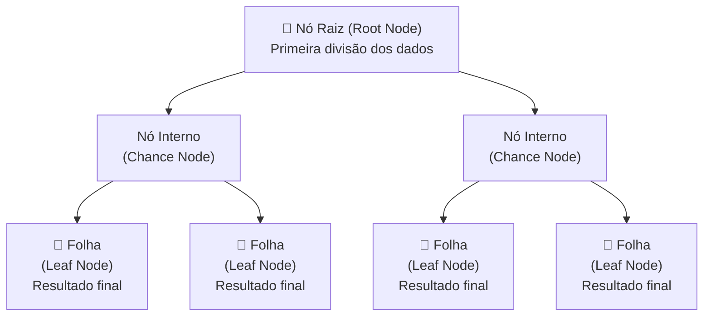

# Árvores de Decisão

## O Que São

**Árvores de Decisão** são modelos de aprendizado supervisionado não paramétricos usados para classificação e regressão. O objetivo é criar um modelo que preveja o valor de uma variável alvo aprendendo regras de decisão simples inferidas a partir das características dos dados. Uma árvore pode ser vista como uma **aproximação constante por partes** — quanto mais profunda a árvore, mais complexas as regras e mais preciso o modelo.

> *Fonte primária: Song & Lu, Shanghai Jiao Tong University — "Decision tree methods: applications for classification and prediction" (PMC4466856)*

---

## Estrutura de uma Árvore de Decisão



### Tipos de Nós

| Nó | Também chamado | Função |
|---|---|---|
| **Nó Raiz** | Decision Node | Divisão inicial — todos os registros partem daqui |
| **Nó Interno** | Chance Node | Representa uma possibilidade a partir do nó pai |
| **Nó Folha** | End Node / Leaf | Resultado final de uma sequência de decisões |

---

## Conceitos Fundamentais

### Divisão (Splitting)

O algoritmo seleciona as variáveis de entrada **mais relevantes** para dividir os nós pai em nós filhos mais "puros" em relação à variável alvo. Os critérios de pureza mais comuns são:

- **Índice Gini** — mede a impureza de uma divisão (usado pelo CART)
- **Entropia / Ganho de Informação** — baseado em teoria da informação (usado pelo ID3/C4.5)
- **Gain Ratio** — tenta corrigir o viés do Information Gain (usado pelo C4.5)
- **Qui-Quadrado (Chi-Square)** — testa independência estatística (usado pelo CHAID)
- **Critério Twoing** — combinação de ganhos (usado pelo CART alternativo)

#### Formalização Matemática

Dado um nó $m$ com $n_m$ amostras, para cada candidato de divisão $\theta = (j, t_m)$ composto por uma feature $j$ e um limiar $t_m$, os dados são particionados em $Q_m^{left}(\theta)$ e $Q_m^{right}(\theta)$:

$$G(Q_m, \theta) = \frac{n_m^{left}}{n_m} H(Q_m^{left}(\theta)) + \frac{n_m^{right}}{n_m} H(Q_m^{right}(\theta))$$

O limiar ótimo é: $\theta^* = \arg\min_{\theta} G(Q_m, \theta)$

**Critérios de classificação:**
- **Gini:** $H(Q_m) = \sum_k p_{mk}(1 - p_{mk})$
- **Entropia:** $H(Q_m) = -\sum_k p_{mk} \log(p_{mk})$

**Critérios de regressão:**
- **MSE:** $H(Q_m) = \frac{1}{n_m} \sum_{y \in Q_m} (y - \bar{y}_m)^2$
- **MAE:** $H(Q_m) = \frac{1}{n_m} \sum_{y \in Q_m} |y - mediana(y)_m|$

### Parada (Stopping)

Regras de parada evitam que a árvore cresça excessivamente e sofra **overfitting**:

- Número mínimo de registros em um nó folha (`min_samples_leaf`)
- Número mínimo de registros antes de dividir (`min_samples_split`)
- Profundidade máxima da árvore (`max_depth`)
- Decréscimo mínimo de impureza (`min_impurity_decrease`)

> 🔖 **Regra prática (Berry & Linoff):** A proporção de registros em cada folha deve estar entre **0,25% e 1%** do dataset de treinamento.

### Poda (Pruning)

Quando as regras de parada não são suficientes, a árvore é **podada** após crescer:

| Tipo de Poda | Descrição |
|---|---|
| **Pré-poda** (forward) | Usa testes estatísticos (Chi-square) para evitar divisões não significativas durante o crescimento |
| **Pós-poda** (backward) | Cresce a árvore completa e remove ramos que não melhoram a acurácia em dados de validação |
| **Cost-Complexity Pruning** | Sequência de árvores podadas parametrizadas por $\alpha \geq 0$; minimiza $R_\alpha(T) = R(T) + \alpha|\tilde{T}|$ |

> O post-pruning é preferível ao pre-pruning porque compensa a subotimalidade da indução gulosa — funciona como um *lookahead*.

---

## Algoritmos de Construção de Árvores

### Algoritmos Single-Tree

| Método | Critério de Seleção | Poda | Split | Tipo |
|---|---|---|---|---|
| **AID** | Somatório dos desvios quadrados | Sem poda | Binário | Regressão |
| **CHAID** | Qui-Quadrado | Sem poda | Múltiplo | Classificação/Regressão |
| **CART** | Gini Index, Twoing | Cost-complexity | Binário | Classificação/Regressão |
| **ID3** | Information Gain (Mutual Information) | Sem poda | Múltiplo | Classificação |
| **C4.5** | Gain Ratio | Significância estatística | Múltiplo | Classificação/Regressão |
| **C5.0** | Gain Ratio (melhorado) | Sim | Múltiplo | Classificação |
| **QUEST** | Chi-square (categ.) / ANOVA (cont.) | Cost-complexity | Binário | Classificação/Regressão |
| **CRUISE** | Qui-Quadrado | Cost-complexity | Múltiplo | Classificação/Regressão |
| **GUIDE** | Estatística $\chi^2$ | Sim | Múltiplo + bivariado | Classificação/Regressão |

> O scikit-learn implementa uma versão otimizada do **CART**. O **C5.0** está disponível no IBM SPSS Modeler.

### Comparação Detalhada

#### Viés de Seleção de Variáveis

Diversos algoritmos são enviesados na hora de escolher variáveis — tendem a favorecer variáveis com mais categorias. Isso afeta tanto a capacidade preditiva quanto a interpretabilidade.

- **Não-enviesados:** FACT, QUEST, CRUISE, GUIDE
- **Enviesados:** C4.5, CART, CHAID

Na prática, com amostras grandes o suficiente, o viés pode não afetar significativamente o modelo.

#### Árvores Binárias vs. Multiway

| Algoritmo | Tipo de Árvore |
|---|---|
| AID, CART, QUEST | Binárias |
| CHAID, C4.5, FACT, CRUISE | Multiway |

Árvores multiway são mais compactas e interpretáveis visualmente, mas podem criar nós com muitos filhos para variáveis categóricas.

#### Univariate vs. Multivariate

A maioria das árvores faz **splits univariados** ($X \geq c$). Árvores multivariadas consideram combinações lineares ($aX_1 + bX_2 \geq c$), gerando árvores mais compactas mas com nós menos interpretáveis. O CART, QUEST, CRUISE e GUIDE suportam splits multivariados.

### Métodos de Ensemble (Comitês de Árvores)

| Método | Princípio | Autor/Ano |
|---|---|---|
| **AdaBoost** | Boosting adaptativo — treina árvores sequencialmente, aumentando peso dos erros | Freund & Schapire, 1996/7 |
| **Random Forest** | Bagging + subconjunto aleatório de features — reduz variância via independência das árvores | Breiman, 2001 |
| **Gradient Boosting** | Cada árvore ajusta o residual do modelo anterior; generalização do AdaBoost | Friedman, 2000/1 |
| **XGBoost** | Gradient Boosting otimizado com regularização e paralelização | Chen & Guestrin, 2016 |

> **Ensemble vs. Single-Tree:** A acurácia do melhor algoritmo single-tree é em média **10% menor** que a de um ensemble (Loh, 2009). Porém, ensembles perdem interpretabilidade.

#### Random Forest — Detalhes

- Cada árvore é treinada em um subconjunto dos dados (bagging)
- Cada árvore recebe um subconjunto aleatório das variáveis
- Importance scoring: permuta cada variável e mede o impacto na predição
- Facilmente paralelizável (árvores independentes)

#### Gradient Boosting — Detalhes

- A $m$-ésima árvore ajusta a diferença entre resposta desejada e predição até então
- Pode usar qualquer função de perda diferenciável (mais robusto a outliers que AdaBoost)
- O AdaBoost é uma instância especial do Gradient Boosting

### Árvores Incrementais (Online)

Algoritmos offline precisam de re-treinamento completo a cada novo dado. Árvores incrementais lidam com chegadas constantes de observações:

- **VFDT** (Very Fast Decision Trees) — Domingos & Hulten, 2000
- **ITI** (Incremental Tree Induction) — Utgoff et al., 1997

### ADTrees (Alternating Decision Trees)

Combinam árvores de decisão e boosting em uma única árvore interpretável. Visita diversas folhas durante a predição e soma os resultados. Resultados comparáveis a ensembles, com maior interpretabilidade.

---

## Implementação no Scikit-Learn

### Classificação

```python
from sklearn.tree import DecisionTreeClassifier

clf = DecisionTreeClassifier(criterion="entropy", max_depth=3)
clf.fit(X_train, y_train)
y_pred = clf.predict(X_test)
```

**Parâmetros de otimização:**
- `criterion`: "gini" (padrão) ou "entropia"
- `splitter`: "best" (padrão) ou "random"
- `max_depth`: profundidade máxima (None = sem limite)
- `min_samples_split`: mínimo de amostras para dividir
- `min_samples_leaf`: mínimo de amostras na folha
- `ccp_alpha`: parâmetro de poda de cost-complexity

### Regressão

```python
from sklearn.tree import DecisionTreeRegressor

reg = DecisionTreeRegressor()
reg.fit(X_train, y_train)
y_pred = reg.predict(X_test)
```

### Visualização

```python
from sklearn.tree import plot_tree, export_text

plot_tree(clf)
print(export_text(clf, feature_names=feature_names))
```

### Tratamento de Valores Ausentes

O DecisionTreeClassifier/Regressor suporta valores ausentes nativamente quando `splitter='best'`:

- Para cada limiar candidato, avalia a divisão com valores ausentes indo para esquerda ou direita
- Empate é resolvido indo para o nó com mais amostras
- Se nenhum valor ausente foi visto no treinamento, mapeia para o filho com mais amostras

### Poda de Cost-Complexity

```python
clf = DecisionTreeClassifier(ccp_alpha=0.01)
```

O parâmetro `ccp_alpha` controla a poda: quanto maior, mais agressiva a poda. O algoritmo encontra a subárvore que minimiza $R_\alpha(T) = R(T) + \alpha|\tilde{T}|$.

### Decision Stump

Uma árvore de decisão com `max_depth=1` — apenas uma divisão. Usado como aprendiz fraco em métodos de ensemble (AdaBoost, Gradient Boosting).

---

## Forças e Fraquezas

| Forças | Fraquezas |
|---|---|
| Alta interpretabilidade — regras "se-então" claras | Instabilidade — pequenas mudanças nos dados alteram a estrutura |
| Visualização intuitiva | Tendência ao overfitting sem regularização/poda |
| Não paramétrico — sem suposições de distribuição | Baixa capacidade de extrapolação |
| Lida com variáveis numéricas e categóricas | Sensível a dados desbalanceados |
| Suporta valores ausentes nativamente | Baixa performance vs. modelos ensemble |
| Robusto a outliers | Pode criar árvores muito complexas |
| Pouco pré-processamento necessário | Não captura interações complexas em uma única árvore |

---

## Dicas de Uso Prático

- Árvores sofrem com **overfitting** em dados com muitos atributos — considere redução de dimensionalidade (PCA, ICA) previamente
- Use `max_depth=3` inicialmente para visualizar e depois ajuste
- Equilibre o conjunto de dados antes do treinamento (balanceamento de classes)
- Para dados esparsos, converta para `csc_matrix` antes de `fit()` e `csr_matrix` antes de `predict()`
- Todas as árvores usam `np.float32` internamente — cópias são criadas se necessário
- Use `min_weight_fraction_leaf` quando as amostras forem ponderadas

---

## Exemplo Prático: Transtorno Depressivo Maior (MDD)

Um estudo de coorte de 4 anos (Batterham et al., 2009) utilizou CART para identificar fatores de risco para MDD a partir de 17 variáveis:

- O modelo gerou **28 subgrupos** do nó raiz às folhas
- A taxa de MDD variou de **0% a 38%** entre os subgrupos
- Fumantes do sexo masculino com escore de depressão 2-3 e sem emprego: **17,2%** de chance
- Não-fumantes: apenas **2%** de chance

---

## Conexões com Outros Tópicos da Wiki

- Árvores de Decisão são a base dos modelos **ensemble** como o **Random Forest** — descritos em [[Data-Mining-Tecnicas]]
- O risco de **overfitting** nas árvores é controlado por poda e [[Regularizacao]]
- O critério de **entropia** conecta as árvores ao [[Teorema-de-Bayes]] (teoria da informação e probabilidade)
- O **CRISP-DM** orienta quando e como aplicar árvores em projetos — ver [[Data-Mining-Tecnicas]]
- A escolha por árvores no passo 6 do **KDD** prioriza a interpretabilidade — ver [[Processo-KDD]]
- Árvores são comparadas com [[Kernel-Trick-e-SVM]] no contexto de classificação com fronteiras não lineares
- Ensembles de árvores são usados no passo 7 do KDD para maximizar acurácia — ver [[Processo-KDD]]

---

## Referências Originais

- Yan-yan Song, Ying Lu — *"Decision tree methods: applications for classification and prediction"* — *Shanghai Archives of Psychiatry*, 2015. PMC4466856.
- scikit-learn — *"1.10. Decision Trees"* — Documentação oficial.
- Vinícius — *"Árvores de decisão: um apanhado geral"* — vinizinho.net.
- Avinash Navlani — *"Tutorial sobre classificação por árvore de decisão em Python"* — DataCamp.

---

## 📂 Fontes Originais
- [[raw/core-knowledge/Decision tree methods_ applications for classification and prediction.md]]
- [[raw/core-knowledge/Decision Trees.md]]
- [[raw/core-knowledge/Árvores de decisão.md]]
- [[raw/core-knowledge/Tutorial sobre classificação por árvore de decisão em Python.md]]
