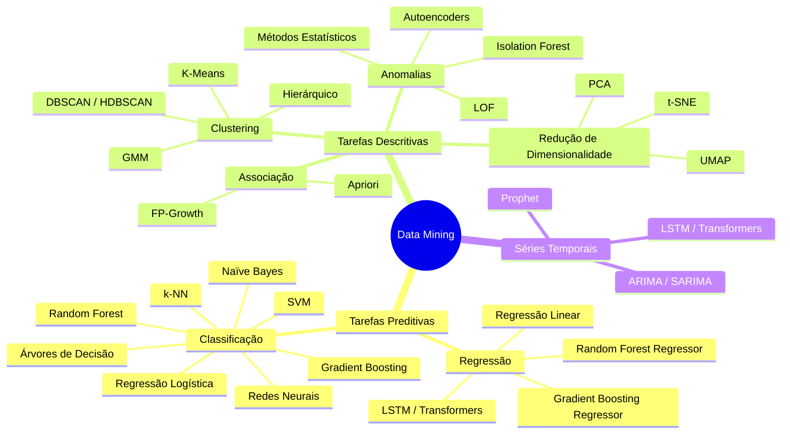
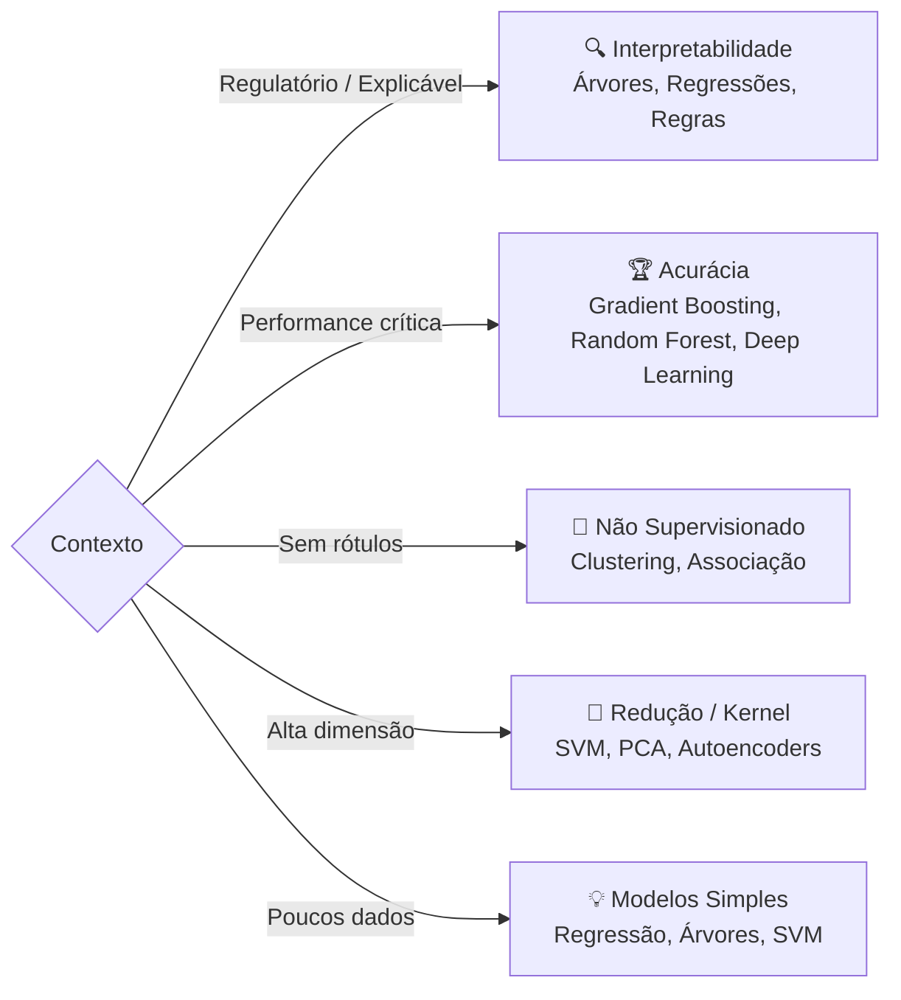
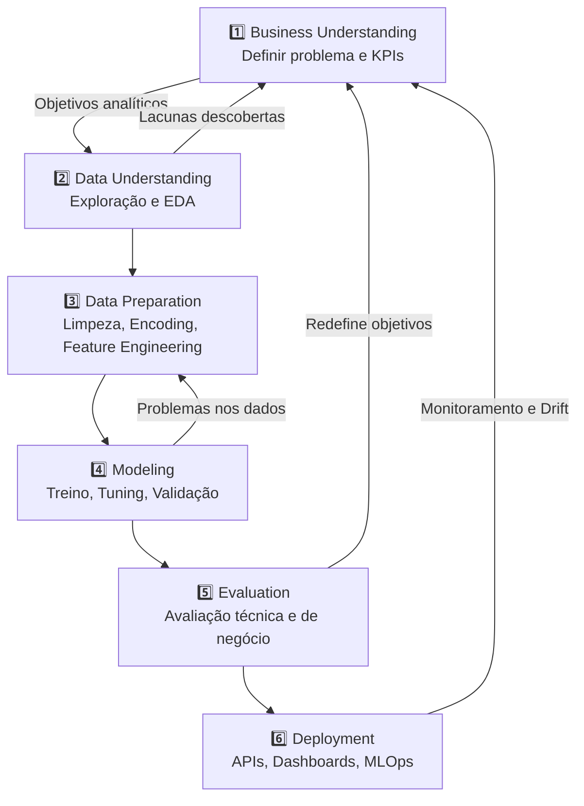

# Data Mining — Técnicas e Metodologia (CRISP-DM)

## O Que é Data Mining

**Mineração de Dados** reúne técnicas estatísticas, matemáticas e computacionais voltadas à **descoberta de padrões, relações e conhecimento** a partir de grandes volumes de dados. Ele se situa na **interseção entre estatística, inteligência artificial e aprendizado de máquina** , e faz parte de um processo mais amplo chamado [[Processo-KDD]] (_Knowledge Discovery in Databases_). O fluxo típico do KDD é:
```
Seleção → Pré-processamento → Transformação → Data Mining → Interpretação/Avaliação
```

O objetivo pode ser:

- **Preditivo:** antecipar eventos ou estimar valores
- **Descritivo:** compreender estruturas, agrupamentos, associações e desvios

> A escolha da técnica depende mais do **cenário do problema** do que do algoritmo em si — natureza dos dados, objetivo analítico, interpretabilidade desejada, disponibilidade de rótulos e restrições computacionais.

---

## Mapa Geral das Técnicas



---

## 1. Tarefas Preditivas: Classificação e Regressão

**Tipo de aprendizado:** Supervisionado | **Necessidade de rótulos:** Sim

### Técnicas Comuns

| Técnica | Forças | Fraquezas | Cenários Indicados |
|---|---|---|---|
| **Árvores de Decisão** (CART, C4.5) | Alta interpretabilidade, visualização, aceita cat. e num. | Instável, tende ao overfitting | Crédito, saúde, sistemas explicáveis |
| **Random Forest** | Excelente performance, reduz overfitting, robusto a ruído | Menor interpretabilidade, custo computacional | Score de risco, dados tabulares |
| **Gradient Boosting** (XGBoost, LightGBM) | Altíssima performance, dados tabulares | Sensível a hiperparâmetros, pode overfittar sem [[Regularizacao]] | Finanças, fraude, churn |
| **Naïve Bayes** | Muito rápido, funciona bem com texto | Assume independência (forte suposição) | Spam, NLP, categorização — ver [[Teorema-de-Bayes]] |
| **Redes Neurais / Deep Learning** | Relações não lineares, imagem, áudio, texto | Baixa interpretabilidade, alto custo | Visão computacional, NLP |
| **SVM** | Eficiente em alta dimensão, bom com poucos dados | Escala mal, ajuste complexo | Bioinformática, texto — ver [[Kernel-Trick-e-SVM]] |
| **k-NN** | Simples, sem treinamento explícito | Predição lenta, sofre em alta dimensão | Sistemas pequenos, exploratório |
| **Regressão Linear/Logística** | Interpretável, excelente baseline | Limitado em relações complexas | Modelos regulatórios, saúde, finanças |

### Quando Priorizar Interpretabilidade vs. Performance



---

## 2. Tarefas Descritivas: Clustering

**Tipo de aprendizado:** Não Supervisionado | **Necessidade de rótulos:** Não

| Técnica | Forças | Fraquezas | Cenários |
|---|---|---|---|
| **K-Means** | Simples, escalável, rápido | Precisa definir K, sensível a outliers, clusters esféricos | Segmentação de clientes |
| **Clustering Hierárquico** | Dendrogramas, não exige K inicial | Alto custo, pouco escalável | Taxonomias, estudos exploratórios |
| **DBSCAN / HDBSCAN** | Detecta formas arbitrárias, identifica ruído | Parâmetros complexos, heterogeneidade difícil | Geolocalização, fraudes, IoT |
| **GMM** | Probabilístico, flexibilidade geométrica | Sensível à inicialização, máximos locais | Segmentação fuzzy, bioestatística |

---

## 3. Mineração de Associações

**Objetivo:** Descobrir padrões de coocorrência e relações frequentes.

| Técnica | Forças | Fraquezas | Cenários |
|---|---|---|---|
| **Apriori** | Simples, forte fundamentação teórica | Muito custoso, explosão combinatória | Bases pequenas/médias |
| **FP-Growth** | Eficiente, evita geração massiva de candidatos | Estruturas complexas, memória | E-commerce, grandes varejistas |

---

## 4. Detecção de Anomalias

**Objetivo:** Identificar padrões raros ou discrepantes.

| Técnica | Forças | Fraquezas | Cenários |
|---|---|---|---|
| **Métodos Estatísticos** | Forte interpretabilidade | Dependem de distribuições, sofrem em alta dim. | Controle de qualidade industrial |
| **LOF** | Detecta anomalias locais | Alto custo, ajuste difícil | Fraudes, dados espaciais |
| **Isolation Forest** | Escalável, sem premissas estatísticas | Menor interpretabilidade | Big Data, logs, observabilidade |
| **Autoencoders** | Padrões complexos, não lineares | Exigem grande volume, baixa interpretabilidade | Deep Learning, IoT, cybersecurity |

---

## 5. Redução de Dimensionalidade

**Objetivo:** Reduzir variáveis preservando informação relevante.

| Técnica | Forças | Fraquezas | Cenários |
|---|---|---|---|
| **PCA** | Simples, eficiente, base estatística | Linear, baixa interpretabilidade semântica | Pré-processamento, dados tabulares |
| **t-SNE** | Excelente visualização, preserva vizinhanças | Alto custo, não escalável | Exploração visual, embeddings |
| **UMAP** | Mais rápido que t-SNE, melhor estrutura global | Sensível a hiperparâmetros | Visualização moderna, grandes datasets |

> **Kernel PCA** combina redução de dimensionalidade com o **Kernel Trick** — ver [[Kernel-Trick-e-SVM]]

---

## 6. Séries Temporais

| Técnica | Características |
|---|---|
| **ARIMA / SARIMA** | Forte para padrões lineares e sazonais; exige estacionariedade |
| **Prophet** | Fácil uso, forte para sazonalidade de negócio |
| **LSTM / Transformers** | Capta dependências longas; alto custo e baixa interpretabilidade |

---

## 7. Metodologia CRISP-DM

O **CRISP-DM (Cross Industry Standard Process for Data Mining)** é a metodologia padrão para estruturar projetos analíticos. É **iterativo, não linear**, orientado ao problema de negócio e independente de tecnologia.



### Conexão das Etapas com Técnicas

| Etapa CRISP-DM | Técnicas Associadas |
|---|---|
| Data Understanding | Estatística descritiva, visualização, clustering exploratório |
| Data Preparation | PCA, feature engineering, normalização, [[Regularizacao]] |
| Modeling | Classificação, regressão, clustering, [[Arvores-de-Decisao]], [[Kernel-Trick-e-SVM]] |
| Evaluation | Métricas estatísticas (AUC, RMSE, Silhouette), validação cruzada |
| Deployment | MLOps, monitoramento de drift, governança de IA |

---

## Complementações Modernas ao CRISP-DM

O CRISP-DM é extremamente relevante, mas projetos modernos exigem extensões:

- **MLOps** — Operacionalização contínua de modelos
- **Data-Centric AI** — Foco na qualidade dos dados, não apenas do modelo
- **Model Governance** — Auditoria, rastreabilidade e conformidade
- **Responsible AI** — Fairness, viés e ética em IA
- **Continuous Learning Pipelines** — Retreinamento adaptativo

---

## Expansões Futuras Planejadas

- Bias-Variance Tradeoff — ver [[Regularizacao]]
- Maldição da Dimensionalidade
- Explainable AI (XAI)
- MLOps e Drift de Modelos
- Balanceamento de Classes (SMOTE, etc.)

---

## Conexões com Outros Tópicos da Wiki

- **KDD (Knowledge Discovery in Databases)** é detalhado em [[Processo-KDD]]
- **Naïve Bayes** é detalhado em [[Teorema-de-Bayes]]
- **Regularização** é aprofundada em [[Regularizacao]]
- **Árvores de Decisão** têm artigo dedicado em [[Arvores-de-Decisao]]
- **SVM e Kernel Trick** têm artigo dedicado em [[Kernel-Trick-e-SVM]]

---

## Referências Originais

- Material de construção própria — *"Data Mining - Técnicas.md"* — `raw/core-knowledge/`
