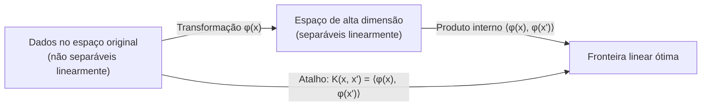
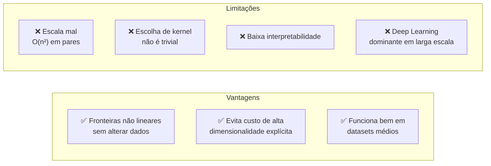

	
# Kernel Trick e Support Vector Machines (SVM)

## O Problema: Dados Não Linearmente Separáveis

Modelos lineares só aprendem fronteiras de decisão lineares — retas em 2D, planos em 3D, hiperplanos em dimensões superiores. Mas a maioria dos dados reais **não é linearmente separável**.



**A ideia central:** projetar os dados em um espaço de dimensão superior onde a separação linear se torna possível — mas *sem realizar essa projeção explicitamente*.

---

## O Que é o Kernel Trick

O **Kernel Trick** é um atalho matemático que permite a modelos baseados em **produtos internos** (dot products) operar em espaços de alta dimensão **sem nunca transformar os dados explicitamente**.

### Princípio Matemático

Em vez de calcular `φ(x)` (a transformação) e depois o produto interno `⟨φ(x), φ(x')⟩`, calcula-se diretamente:

```
K(x, x') = ⟨φ(x), φ(x')⟩
```

A **função kernel** `K` retorna o mesmo resultado que calcular o produto interno no espaço transformado, porém diretamente no espaço original. Equivale a uma **função de similaridade** entre os pontos.

> ⚠️ O Kernel Trick **só funciona** com modelos que dependem de produtos internos em sua otimização (SVMs, Processos Gaussianos, Kernel PCA). Ele **não se aplica** a árvores, redes neurais ou regressão linear clássica.

---

## SVMs e o Kernel Trick

Um **SVM** encontra a fronteira de decisão que **maximiza a margem** entre as classes. Na forma dual do problema de otimização, o SVM depende apenas de **produtos internos** entre pares de pontos:

```
Objetivo Dual:
max Σ αᵢ - (1/2) Σᵢ Σⱼ αᵢαⱼyᵢyⱼ⟨xᵢ, xⱼ⟩
```

Substituindo `⟨xᵢ, xⱼ⟩` por `K(xᵢ, xⱼ)`:

```
max Σ αᵢ - (1/2) Σᵢ Σⱼ αᵢαⱼyᵢyⱼ K(xᵢ, xⱼ)
```

O SVM opera exatamente da mesma forma — mas "acredita" estar em um espaço mais rico.

---

## Funções Kernel Comuns

| Kernel | Fórmula | Espaço Implícito | Quando Usar |
|---|---|---|---|
| **Linear** | `K(x,x') = xᵀx'` | Original (sem transformação) | Dados já separáveis linearmente |
| **Polinomial** | `K(x,x') = (xᵀx' + c)ᵈ` | Polinomial de grau d | Interações entre features |
| **RBF / Gaussiano** | `K(x,x') = exp(-γ‖x-x'‖²)` | **Infinito-dimensional** | Padrão — fronteiras complexas |
| **Sigmoid** | `K(x,x') = tanh(αxᵀx' + c)` | — | Raro; nem sempre válido matematicamente |

### O Kernel RBF em Detalhes

O **Radial Basis Function (RBF)** é o mais utilizado na prática:
- Mede **similaridade por distância** entre pontos
- Mapeia dados em um espaço de **dimensão infinita**
- Dá ao SVM flexibilidade para aprender qualquer fronteira não linear
- É um bom ponto de partida para a maioria dos problemas

---

## Kernel Trick vs. Feature Engineering

| Aspecto | Feature Engineering | Kernel Trick |
|---|---|---|
| **Abordagem** | Cria features explicitamente | Opera implicitamente no espaço transformado |
| **Interpretabilidade** | Alta — sabe-se o que cada feature representa | Baixa — espaço implícito difícil de inspecionar |
| **Flexibilidade** | Limitada ao que o analista imagina | Muito alta — pode mapear para dim. infinita |
| **Custo** | Depende das novas features | O(n²) em pares de dados — escala mal |

---

## Vantagens e Limitações



### Quando Ainda Usar Kernel Methods (2026)

- Dados com **estrutura não linear** e **tamanho médio** (milhares de amostras, não milhões)
- Quando **não é necessário explicar** previsões individuais
- Domínios especializados: **bioinformática**, classificação de texto com features manuais
- Quando a generalização é necessária sem muito volume de dados

---

## Extensões além do SVM

O Kernel Trick não é exclusivo do SVM:

| Modelo | Aplicação |
|---|---|
| **Kernel Ridge Regression** | Regressão em espaço de alta dimensão via kernel |
| **Processos Gaussianos** | Kernel define a covariância — pressupostos sobre suavidade da função |
| **Kernel PCA** | Extensão não linear do PCA clássico |

---

## Exemplo Conceitual: Círculos Concêntricos

Dados em dois círculos concêntricos são **impossíveis de separar linearmente** no espaço 2D. Um SVM linear falha completamente. Com kernel RBF:

- O kernel mapeia os pontos para um espaço onde os círculos se tornam separáveis
- A fronteira de decisão aparece como um círculo no espaço original
- O SVM **nunca manipulou os dados** — apenas calculou os kernels entre pares

---

## Conexões com Outros Tópicos da Wiki

- SVM com kernel linear é equivalente a modelos de **regressão logística regularizada** — ver [[Regularizacao]]
- SVMs são citados em [[Data-Mining-Tecnicas]] como técnica recomendada para alta dimensionalidade e dados escassos
- A maximização de margem no SVM tem relação probabilística com o **Classificador Ótimo de Bayes** — ver [[Teorema-de-Bayes]]
- **Kernel PCA** combina o Kernel Trick com a redução de dimensionalidade descrita em [[Data-Mining-Tecnicas]]
- Em [[Arvores-de-Decisao]], as fronteiras são sempre paralelas aos eixos; o kernel SVM oferece fronteiras curvas mais flexíveis

---

## Referências Originais

- Dario Radečić — *"Kernel Trick Explained: SVMs and Nonlinear Patterns"* — DataCamp, 2026
- Omar Elmofty — *"The Kernel Trick in Machine Learning"* — Medium, 2025

---

## 📂 Fontes Originais
- [[raw/core-knowledge/Kernel Trick Explained SVMs and Nonlinear Patterns.md]]
- [[raw/core-knowledge/The Kernel Trick in Machine Learning.md]]
