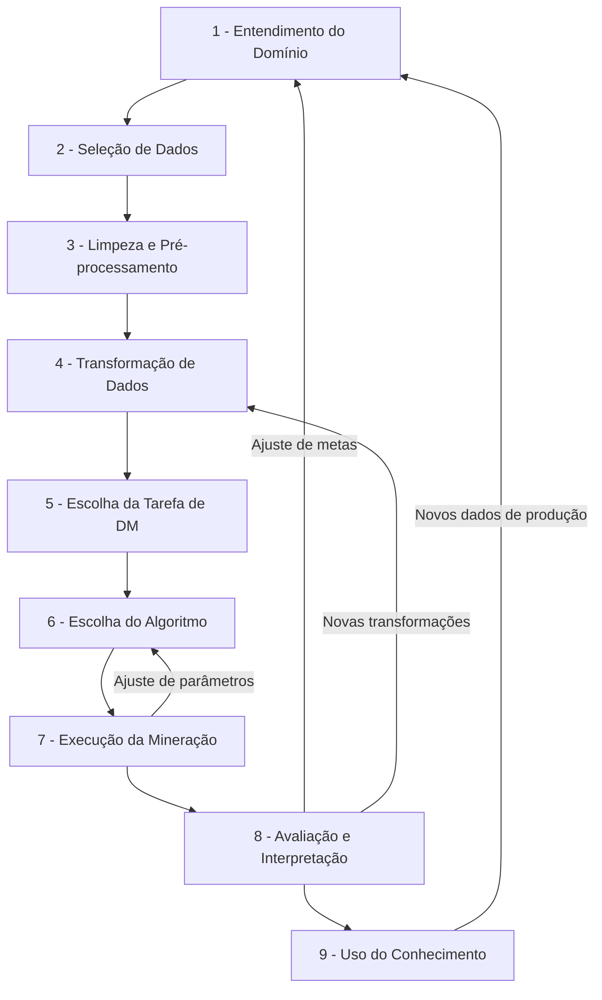

# Descoberta de Conhecimento em Bancos de Dados (KDD)

A **Descoberta de Conhecimento em Bancos de Dados (KDD - Knowledge Discovery in Databases)** refere-se ao processo amplo e iterativo de extrair padrões significativos e **conhecimentos acionáveis** a partir de grandes volumes de dados. O KDD é um campo de intersecção que engloba aprendizado de máquina (Machine Learning), reconhecimento de padrões, estatística, inteligência artificial e visualização de dados.

O objetivo unificador do processo de KDD é encontrar informações úteis no contexto de grandes bancos de dados. Esse processo não é linear, mas sim **repetitivo e interativo**, composto por nove etapas sequenciais, onde o analista frequentemente precisa retornar a etapas anteriores com base nos achados de fases subsequentes.

---

## O Fluxo Iterativo do KDD (9 Etapas)

---

## Detalhamento das Etapas

### 1. Entendimento do Domínio de Aplicação
Esta é a **etapa preparatória essencial**. Envolve compreender o negócio ou a área de aplicação, definir os objetivos do usuário final e identificar o conhecimento prévio relevante disponível. Sem clareza nesta fase, os modelos matemáticos gerados posteriormente podem ser precisos, mas inúteis para o negócio.

### 2. Seleção e Criação do Conjunto de Dados
Consiste em determinar quais fontes de dados serão utilizadas (como Data Warehouses, bancos transacionais ou tabelas planas) e consolidar os dados necessários em um conjunto de trabalho unificado, selecionando os atributos (variáveis) relevantes. 
*   **Trade-off:** Há um equilíbrio dinâmico entre o custo de coletar/processar grandes repositórios de dados e o benefício de ter mais atributos para modelagem.

### 3. Pré-processamento e Limpeza
Fase voltada ao aumento da confiabilidade dos dados. Envolve:
*   Tratamento de valores ausentes (missing values).
*   Detecção e remoção de *outliers* (valores discrepantes).
*   **Técnica Avançada:** Atributos importantes com dados ausentes podem ser tratados como o "alvo" de um algoritmo de mineração supervisionado secundário, prevendo os valores faltantes com base nas outras variáveis confiáveis.

### 4. Transformação de Dados
Preparação dos dados especificamente para o consumo dos algoritmos de mineração. Inclui:
*   **Redução de dimensionalidade:** Seleção e extração de características (*feature selection* e *feature extraction*).
*   **Amostragem:** Seleção de registros.
*   **Transformações funcionais:** Discretização de atributos numéricos contínuos, normalização de intervalos e criação de métricas calculadas (ex: quociente entre diferentes exames médicos).

### 5. Escolha da Tarefa de Mineração de Dados
Definição do tipo de análise a ser feita com base nos objetivos:
*   **Tarefas Preditivas (Supervisionadas):** Classificação e regressão (onde o modelo aprende a partir de exemplos com rótulos conhecidos).
*   **Tarefas Descritivas (Não-Supervisionadas):** Agrupamento (*clustering*), detecção de anomalias, associação e visualização.

### 6. Escolha do Algoritmo de Mineração de Dados
Seleção do método específico de indução. Nesta fase, avalia-se o equilíbrio entre **precisão** (desempenho absoluto) e **interpretabilidade** (compreensão do modelo):
*   Modelos de alta precisão e baixa interpretabilidade: Redes Neurais.
*   Modelos de alta interpretabilidade: [[Arvores-de-Decisao]].
*   **Meta-aprendizado:** Estudo das condições sob as quais determinados algoritmos performam melhor em tipos específicos de problemas, definindo também as táticas de validação (ex: validação cruzada k-fold).

### 7. Execução da Mineração de Dados (Data Mining)
Aplicação prática do algoritmo sobre os dados transformados. Esta fase é executada múltiplas vezes ajustando os hiperparâmetros do modelo (ex: número mínimo de instâncias por folha em uma árvore de decisão ou penalidade de [[Regularizacao]]) até obter um desempenho satisfatório.

### 8. Avaliação e Interpretação
Análise dos padrões gerados para verificar sua utilidade, validade e novidade em relação aos objetivos de negócio definidos no Passo 1. Inclui a interpretação dos resultados, visualização dos modelos e a documentação formal do conhecimento gerado.

### 9. Uso do Conhecimento Descoberto
Integração do modelo ou do padrão descoberto em sistemas operacionais ativos para apoiar tomadas de decisão em tempo real. O principal desafio é a perda das "condições de laboratório" estáticas: em produção, os dados são dinâmicos, e a distribuição dos dados pode mudar ao longo do tempo (conceito de *data drift*).

---

## Conexões com o Restante da Wiki

*   **Metodologias Alternativas:** O KDD possui grande similaridade e correlação direta com a metodologia CRISP-DM, detalhada em [[Data-Mining-Tecnicas]].
*   **Algoritmos de Classificação:** As árvores de decisão descritas em [[Arvores-de-Decisao]] são frequentemente utilizadas no Passo 6 para priorizar a interpretabilidade do conhecimento descoberto.
*   **Ajuste de Parâmetros:** O controle de overfitting no Passo 7 frequentemente envolve a aplicação de termos de penalização estudados em [[Regularizacao]].
