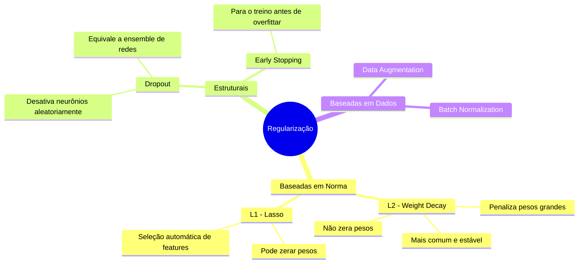
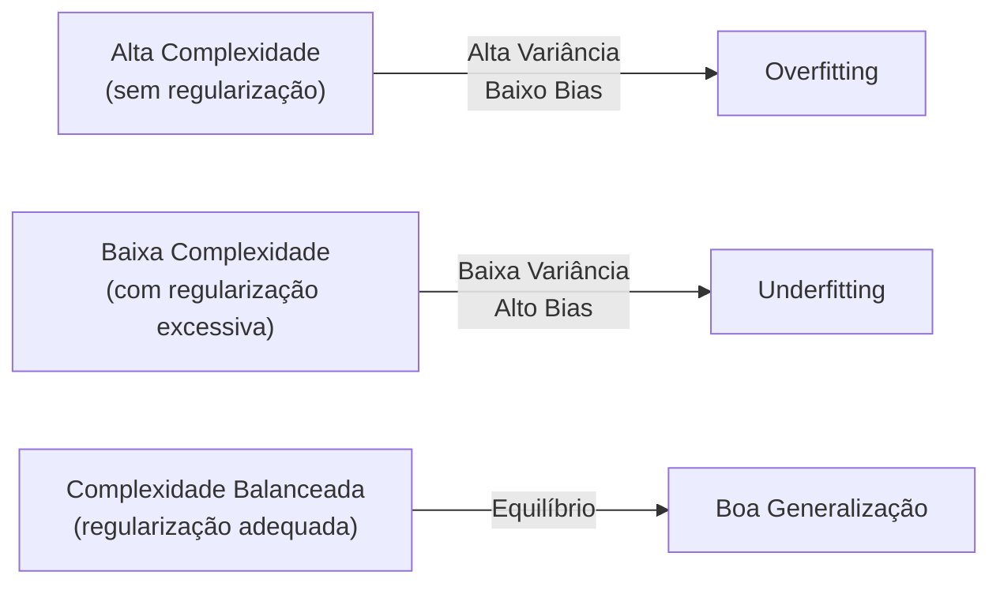

# Regularização

## O Que É

**Regularização** é um conjunto de técnicas que combatem o **overfitting** em modelos de aprendizado de máquina, restringindo a complexidade do modelo durante o treinamento. O objetivo é garantir que o modelo **generalize bem** para dados não vistos, em vez de memorizar os dados de treinamento.

> *"A regularização pode nos dar uma varinha mágica computacional que ajuda nossas redes a generalizar melhor, mas não nos dá uma compreensão baseada em princípios de como a generalização funciona."*
> — Deep Learning Book (DSA, adaptado de Nielsen)

---

## O Problema: Overfitting vs. Generalização


### Analogia com Polinômios

Dado um conjunto com 10 pontos:

| Modelo | Comportamento | Risco |
|---|---|---|
| **Polinômio de grau 9** | Ajuste perfeito aos dados | Overfitting — memoriza ruído |
| **Modelo linear y = 2x** | Ajuste simples e robusto | Generalização — captura padrão real |

O modelo mais simples que explica os dados é preferível (**Navalha de Occam**).

---

## Como a Regularização Funciona em Redes Neurais

Em redes neurais regularizadas, os **pesos são mantidos pequenos**:

1. **Pesos pequenos** → mudanças na entrada causam pouca variação na saída
2. A rede aprende **padrões frequentes e robustos** nos dados
3. A rede fica **resistente ao ruído** específico do conjunto de treinamento
4. Resultado: o modelo **generaliza melhor** para novos dados

> **Insight:** Uma rede com 100 neurônios ocultos tem ~80.000 parâmetros. Com apenas 50.000 exemplos de treino, seria matematicamente fácil decorar tudo — mas com regularização, a rede ainda generaliza bem.

---

## Técnicas de Regularização



### L2 — Regularização Ridge (Weight Decay)

Adiciona à função de custo um termo proporcional ao **quadrado dos pesos**:

```
Custo_regularizado = Custo_original + λ × Σ(w²)
```

- **Efeito:** Pressiona os pesos em direção a zero, mas raramente os zera completamente
- **Bias:** Geralmente **não é regularizado** — vieses grandes não tornam o modelo mais sensível ao ruído da mesma forma que pesos grandes

### L1 — Regularização Lasso

Penaliza o **valor absoluto** dos pesos:

```
Custo_regularizado = Custo_original + λ × Σ|w|
```

- **Efeito:** Pode zerar pesos completamente — equivale à **seleção automática de features**

### Dropout

Desativa aleatoriamente neurônios durante o treinamento:
- Funciona como um **ensemble implícito** de arquiteturas diferentes
- Força redundância e robustez na representação aprendida

---

## Por Que a Regularização Funciona? A Questão em Aberto

> "A verdade é que ninguém ainda desenvolveu uma explicação teórica inteiramente convincente para explicar porque a regularização ajuda a generalizar as redes."

O que se sabe empiricamente:
- Redes regularizadas **geralmente generalizam melhor**
- A dinâmica do gradiente descendente tem um efeito de **"autorregulação"** natural
- Modelos de redes neurais profundas são frequentemente chamados de **"caixa preta"** justamente por isso

---

## Relação com Bias-Variance Tradeoff



A regularização é o principal mecanismo para ajustar esse tradeoff em modelos paramétricos.

---

## Multicolinearidade e Regularização

A regularização, especialmente **L2 (Ridge)**, também combate a **multicolinearidade** — situação onde variáveis preditoras são altamente correlacionadas, causando instabilidade nos coeficientes de modelos como regressão linear.

---

## Conexões com Outros Tópicos da Wiki

- **Gradient Boosting** (XGBoost, LightGBM) sofre overfitting sem regularização — ver [[Data-Mining-Tecnicas]]
- A suposição de independência do **Naïve Bayes** o torna naturalmente menos suscetível ao overfitting — ver [[Teorema-de-Bayes]]
- O **Kernel Trick no SVM** utiliza o conceito de margem máxima, que é uma forma implícita de regularização — ver [[Kernel-Trick-e-SVM]]
- **Árvores de Decisão** combatem overfitting via poda (pruning), analogamente à regularização — ver [[Arvores-de-Decisao]]
- O **CRISP-DM** inclui validação cruzada e avaliação como etapas para detectar overfitting — ver [[Data-Mining-Tecnicas]]

---

## Referências Originais

- Equipe DSA — *"Capítulo 21 - Afinal, Por Que a Regularização Ajuda a Reduzir o Overfitting?"* — deeplearningbook.com.br, 2025
- IBM Think — *"O que é Regularização?"* — ibm.com/br-pt

---

## 📂 Fontes Originais
- [[raw/core-knowledge/Deep Learning Book-Cap 21 - Afinal, Por Que a Regularização Ajuda a Reduzir o Overfitting.md]]
- [[raw/core-knowledge/O que é Regularização_IBM.md]]
