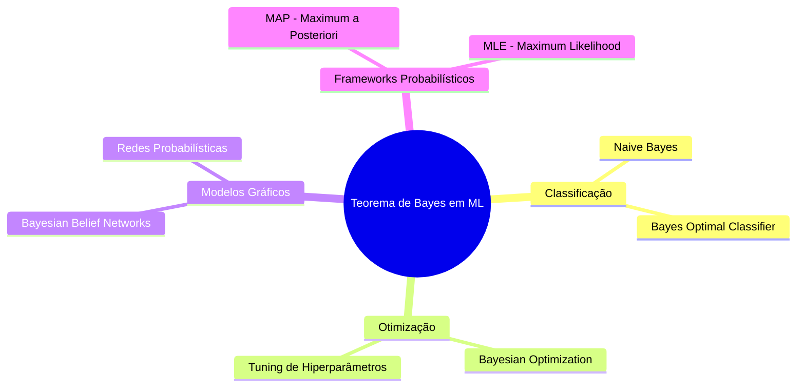

# Teorema de Bayes

## O Que É

O **Teorema de Bayes** fornece uma forma principiada de calcular uma **probabilidade condicional** sem precisar da probabilidade conjunta diretamente. É nomeado em homenagem ao Reverendo Thomas Bayes e é fundamental tanto na teoria da probabilidade quanto no aprendizado de máquina.

A fórmula central é:

```
P(A|B) = P(B|A) × P(A) / P(B)
```

Ou, na forma expandida, quando P(B) não está disponível diretamente:

```
P(A|B) = P(B|A) × P(A) / [P(B|A) × P(A) + P(B|¬A) × P(¬A)]
```

---

## Revisão dos Tipos de Probabilidade

Antes de entender o Teorema de Bayes, é essencial dominar três conceitos básicos:

| Tipo | Definição | Notação |
|---|---|---|
| **Marginal** | Probabilidade de um evento independente de outros | P(A) |
| **Conjunta** | Probabilidade de dois ou mais eventos simultâneos | P(A, B) |
| **Condicional** | Probabilidade de um evento dado outro | P(A \| B) |

A probabilidade conjunta é simétrica: `P(A, B) = P(B, A)`.
A probabilidade condicional **não é simétrica**: `P(A|B) ≠ P(B|A)`.

---

## Nomenclatura dos Termos

Em diferentes contextos, os componentes do teorema ganham nomes específicos:

| Termo | Significado | Papel |
|---|---|---|
| **P(A)** | *Prior* (A Priori) | Crença anterior à evidência |
| **P(B\|A)** | *Likelihood* (Verossimilhança) | Probabilidade da evidência dado o evento |
| **P(B)** | *Evidência* | Probabilidade marginal da observação |
| **P(A\|B)** | *Posterior* (A Posteriori) | Crença atualizada após a evidência |

A equação pode ser resumida como:

```
Posteriori = Verossimilhança × Prior / Evidência
```

---

## Exemplo Prático: Teste Diagnóstico de Câncer

Um exemplo clássico que demonstra a **falácia da taxa base** (*base rate fallacy*):

- **Sensibilidade (TPR):** 85% — P(Teste+|Câncer) = 0,85
- **Especificidade (TNR):** 95% — P(Teste-|Sem Câncer) = 0,95
- **Prevalência (taxa base):** 0,02% — P(Câncer) = 0,0002

**Cálculo:**

```
P(Teste+) = P(Teste+|Câncer) × P(Câncer) + P(Teste+|Sem Câncer) × P(Sem Câncer)
           = 0,85 × 0,0002 + 0,05 × 0,9998
           = 0,00017 + 0,04999 ≈ 0,05016

P(Câncer|Teste+) = 0,85 × 0,0002 / 0,05016 ≈ 0,0034 (0,34%)
```

**Conclusão importante:** Um teste positivo com alta sensibilidade, numa doença rara, ainda gera uma probabilidade real de câncer bastante baixa. Ignorar a taxa base é um erro cognitivo muito comum.

---

## Conexão com Classificadores Binários

O teorema se conecta diretamente às métricas de classificação:

```mermaid
flowchart LR
    A[P(B|A) = TPR = Sensibilidade] --> B[Bayes Theorem]
    C[P(A) = Positive Class Rate] --> B
    D[P(B|¬A) = FPR = 1 - Especificidade] --> B
    B --> E[P(A|B) = Posterior = Precisão = PPV]
```

- **TPR (True Positive Rate)** → Sensibilidade
- **TNR (True Negative Rate)** → Especificidade
- **FPR (False Positive Rate)** → 1 - Especificidade
- **P(A|B)** → Equivale ao **PPV (Positive Predictive Value)** da matriz de confusão

---

## Bayes para Modelagem de Hipóteses (MAP)

Em ML, podemos tratar um modelo como uma **hipótese (h)** e os dados como **evidências (D)**:

```
P(h|D) = P(D|h) × P(h) / P(D)
```

A busca pela hipótese com maior probabilidade posterior é chamada de **Maximum A Posteriori (MAP)**. Quando o prior é uniforme, MAP se reduz a **Maximum Likelihood Estimation (MLE)**.

---

## Bayes para Classificação

O Teorema fornece a estrutura para classificadores probabilísticos:

```
P(classe | dados) = P(dados | classe) × P(classe) / P(dados)
```

### Naïve Bayes

O classificador **Naïve Bayes** simplifica assumindo **independência condicional** entre as features:

```
P(classe | X1, X2, ..., Xn) = P(X1|classe) × P(X2|classe) × ... × P(Xn|classe) × P(classe)
```

| Aspecto | Detalhes |
|---|---|
| **Vantagem** | Muito rápido, funciona bem com texto (NLP), pouca necessidade computacional |
| **Limitação** | Suposição de independência raramente é verdade no mundo real |
| **Aplicações** | Classificação de spam, NLP, categorização de documentos |

### Classificador Ótimo de Bayes

O **Bayes Optimal Classifier** representa o **limite teórico de performance** — nenhum outro modelo pode superá-lo em média. O erro mínimo possível é chamado de **Bayes Error**.

---

## Aplicações em Machine Learning



### Otimização Bayesiana

Utiliza uma **função substituta probabilística** (surrogate function) para guiar a busca por hiperparâmetros ótimos de forma eficiente, evitando avaliações desnecessárias da função objetivo original.

### Redes de Crença Bayesiana

Modelos gráficos que capturam explicitamente as **dependências condicionais** entre variáveis aleatórias por meio de grafos dirigidos. Ausência de conexões implica independência condicional.

---

## Conexões com Outros Tópicos da Wiki

- O **Naïve Bayes** é uma técnica de classificação descrita em [[Data-Mining-Tecnicas]]
- A suposição de independência no Naïve Bayes se conecta ao conceito de **multicolinearidade** e à necessidade de [[Regularizacao]]
- SVM e Bayes compartilham o espaço de classificadores em alta dimensionalidade — ver [[Kernel-Trick-e-SVM]]
- O **Bayes Optimal Classifier** é o benchmark teórico para avaliar qualquer modelo preditivo, incluindo [[Arvores-de-Decisao]]

---

## Referências Originais

- Jason Brownlee — *A Gentle Introduction to Bayes Theorem for Machine Learning* (machinelearningmastery.com, 2019)
- IBM Think — *O que são classificadores Naïve Bayes?* (ibm.com/br-pt)
