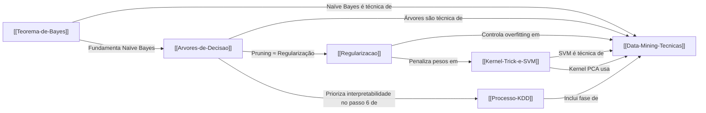

# Catálogo Mestre da Base de Conhecimento

Este índice organiza toda a base de conhecimento compilada e conectada. Editado ativamente pelo Gemini Knowledge Engine (GKE).

---

## 🏛 Core Knowledge (O Cofre Conceitual)

### Probabilidade e Estatística

- [[Teorema-de-Bayes]] — Teorema de Bayes, Naïve Bayes, MAP, Classificador Ótimo, Otimização Bayesiana

### Machine Learning: Fundamentos

- [[Regularizacao]] — Overfitting, L1/L2, Dropout, Bias-Variance Tradeoff, generalização
- [[Kernel-Trick-e-SVM]] — Kernel Trick, SVM, funções kernel (RBF, Polinomial, Linear), separabilidade

### Machine Learning: Modelos de Classificação

- [[Arvores-de-Decisao]] — CART, C4.5, CHAID, QUEST, splitting, pruning, stopping
- [[Teorema-de-Bayes]] — Naïve Bayes Classifier (classificador bayesiano)

### Data Mining e Metodologia

- [[Data-Mining-Tecnicas]] — Coletânea completa de técnicas (classificação, clustering, associação, anomalias, dimensionalidade, séries temporais) + CRISP-DM
- [[Processo-KDD]] — O processo de 9 etapas de Descoberta de Conhecimento em Bancos de Dados

---

## 📖 Logbook (O Diário Empírico)

*(Vazio. Adicione notas de projetos e análises na pasta `raw/logbook/` para gerar os ciclos de vida dos projetos)*

---

## 🔗 Grafo de Conexões

